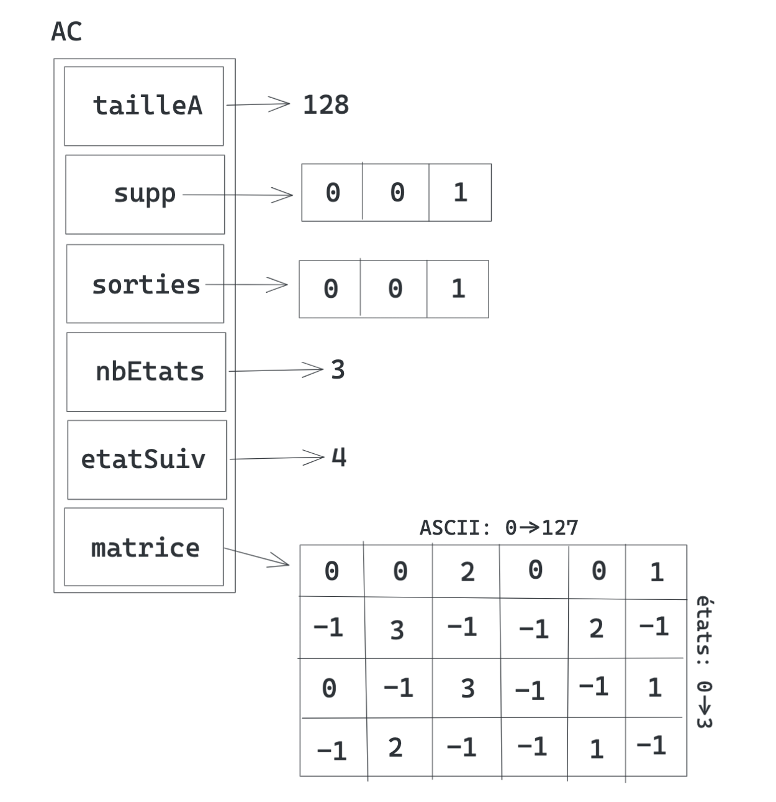

# Aho-Corasick

C implementation of [Aho-Corasick algorithm](https://en.wikipedia.org/wiki/Aho%E2%80%93Corasick_algorithm) with transition matrix.

## Data structure



## Installation

Just run

```sh
make && make clean && chmod +x rechAC
```

Tested on Apple clang version 12.0.5 (clang-1205.0.22.9))

## Usage

```
./rechAC words.txt text.txt
```

Availabled options :

```
-v    : Print states
-vv   : Print filled transition matrix
-v -vv: Print both
```

---

If you want to test with example data

```sh
./rechAC examples/english_words.txt examples/english_text.txt
```

or

```sh
./rechAC examples/dna_words.txt examples/dna_sequence.txt
```

---

Help page:

```
./rechAC -h

USAGE: rechAC [-h] [-v] [-vv] mot texte

Personal implementation of Aho-Corasick algorithm

POSITIONAL ARGUMENTS:
	mot	    Path to file containing words to search
	texte   Path to file containing text to search in

OPTIONAL ARGUMENTS:
	-h		show this help message and exit
	-v		show states during search
	-vv		show Aho-Corasick data structure
```
